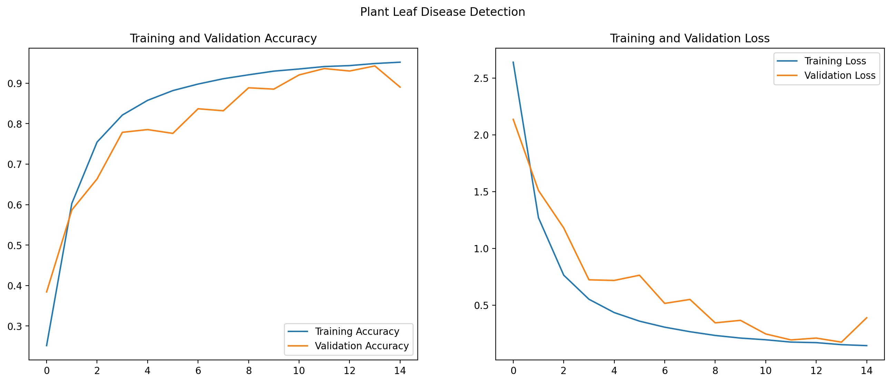
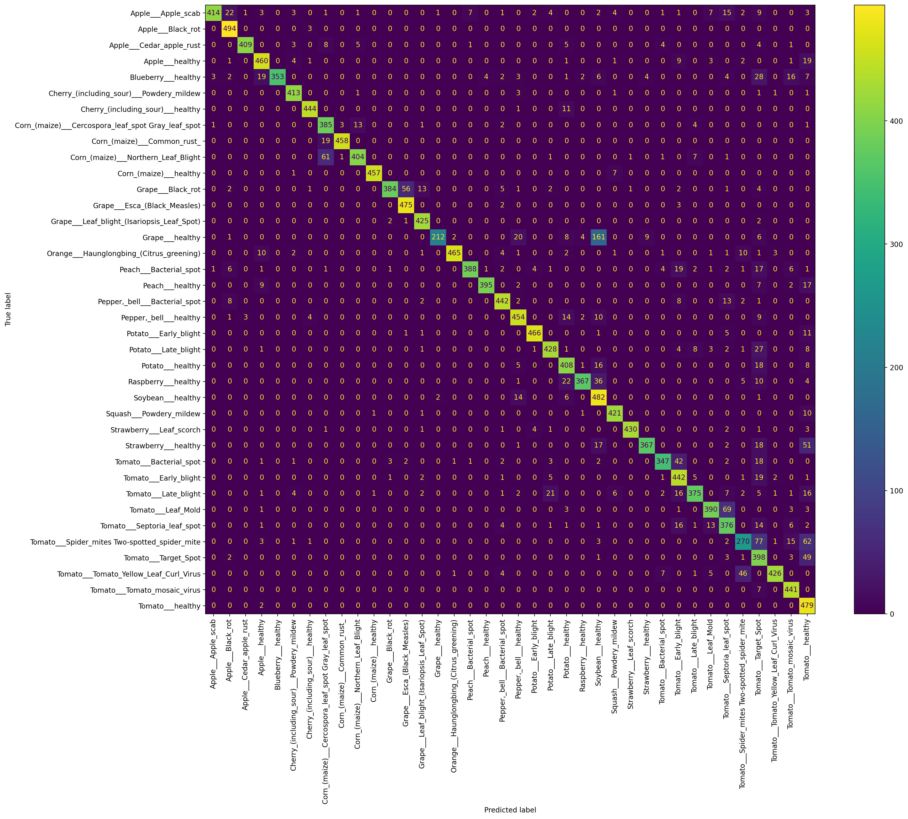

# Plant Leaf Disease Detection
**Deep learning using tensorflow on image dataset containing different healthy and unhealthy crop leaves.** 

## Dataset
The dataset for this project can be downloaded from:
- [New Plant Diseases Dataset (Kaggle)](https://www.kaggle.com/vipoooool/new-plant-diseases-dataset)

This dataset consists of 87,900 images of leaves spanning 38 classes. Each class denotes a combination of the plant the leaf is from and the disease (or lack thereof) present in the leaf. All images are 256*256 in resolution.

The dataset is divided into three parts as follows:

- **train** - 70,295 images divided into 38 classes with 1,642 to 2,022 images per class.
- **valid** - 17,572 images divided into 38 classes with 410 to 505 images per class.
- **test** - 33 images (These images are not divided into their respective classes but the class can be inferred from the image filename)

## Project Requirements
The external libraries required for running _**Train.ipynb**_ are:
1. numpy
2. pandas
3. matplotlib
4. sklearn/scikit-learn
5. tensorflow (Version 2.3.0 or higher preferred)

## Model
The model used is a deep Convolutional Neural Network with skip connections and was created using tensorflow.keras Functional API.

The different layers used in this model are as follows:
- Input 
- Depthwise Convolution 2D
- Convolution 2D
- Max Pooling 2D
- Global Average Pooling 2D
- Concatenation
- Dropout
- Dense

The model makes sure of **Early Stopping** and **Tensorboard** callbacks to prevent overfitting and monitor training respectively.

### Structure

### Accuracy and Loss

### Confusion Matrix for Validation data

### Metrics

|                               | Train  | Validation | Test   |
|-------------------------------|--------|------------|--------|
| **Count of Records**          | 70,295 | 17,572     | 33     |
| **Categorical Cross-entropy** | 0.1908 | 0.186      |   -    |
| **Categorical Accuracy**      | 93.70% | 93.91%     | 93.93% |

&nbsp;

### TensorBoard

Use the command _**tensorboard --logdir tensorboard_logs/fit**_ using the command line from the project's root directory to open the TensorBoard GUI in your browser.

### Notes
- Make sure to update the _**BASE_PATH**_ constant in _**Train.ipynb**_ to reflect the location where your dataset is stored.

> Developed by - Mayur Garg